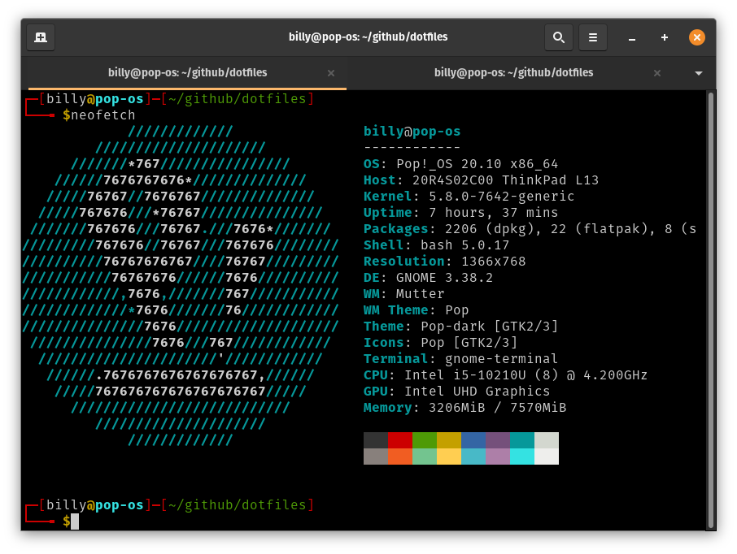

## Preamble

I've recently installed  [Pop! OS](https://pop.system76.com) on my new laptops and I've been slowly re-learning [bash scripting](https://ryanstutorials.net/bash-scripting-tutorial/). I started programming at school about 35 years and later while I was at University studying computing.

This is fork of a mature project that extends the bash setup on my Laptops and any other computer I care to install it on, I'll be adding functionality when time permits. At the moment, I'm quite enjoying the whole process, as it help me re-learn languages and techniques that I once used on a daily basis, the ones that I no longer use in my current job.

It scratches an itch. :smile:



## Installation

You will need to install git first before downloading the dotfiles, to install git, type the following at the prompt.

```shell scripting
sudo apt install git
```

### Download and change folder
```shell scripting
cd ~
git clone https://github.com/Billy-Dickson/dotfiles.git
cd dotfiles
```
### Run installer
```shell scripting
./install.sh
```
## Removal

### Change to dotfiles folder
```shell scripting
cd ~/dotfiles
```

### Run uninstaller
```shell scripting
./uninstall.sh
```

## References and helpfull links
[Tmux Cheat Sheet](https://tmuxcheatsheet.com/)  
[Vim Cheat Sheet](https://devhints.io/vim)  
[Bash scripting Cheat sheet](https://devhints.io/bash)  
[Bash handbook](https://github.com/denysdovhan/bash-handbook)  
[Emoji Cheat sheet](https://github.com/ikatyang/emoji-cheat-sheet#table-of-contents)  
[A list of tmux plugins.](https://github.com/tmux-plugins/list)
[A list of programming languages known to github](https://github.com/github/linguist/blob/master/lib/linguist/languages.yml)   
